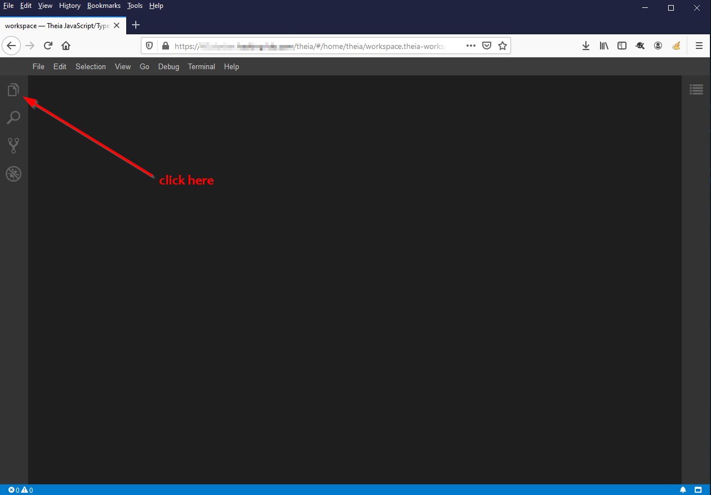
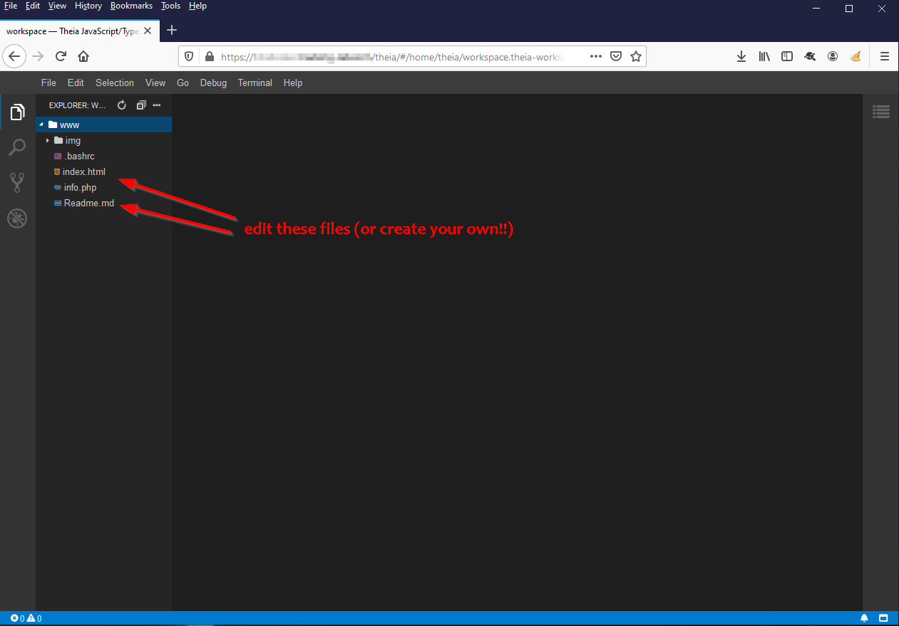
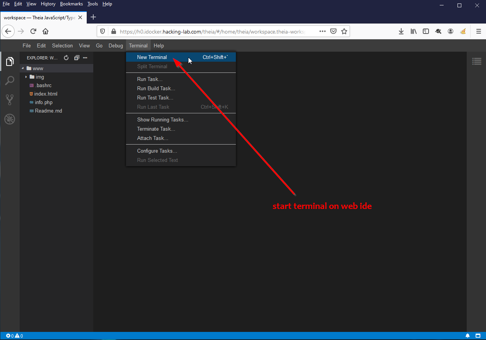
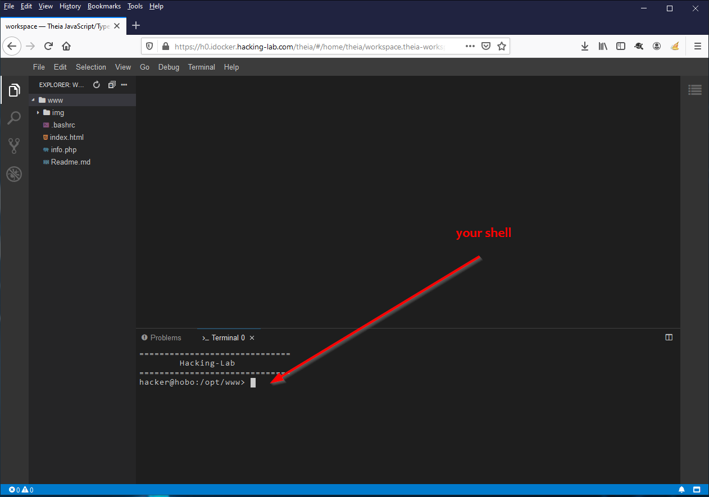

# Your Alpine Linux Hacker Station
This service provides features for the `attacker` in a `Hacking-Lab` training or `ctf` capture the flag event. With the `Hacker Station` you can run an `attacker web site` hosting the code for a `xss` or `xsrf` or similar attacks. A `php-enabled nginx` will run the code in `/opt/www` foder. You can change, add, modify, delete the files in `/opt/www` using the `Theia Web IDE` editor. 

## Your <a href="/theia/#/home/theia/workspace.theia-workspace" target="_blank">Theia Web IDE</a>

Please click on the `workspace` icon in the <a href="/theia/#/home/theia/workspace.theia-workspace" target="_blank">Theia Web IDE</a> and edit the files in `/opt/www` 

Once you have openend the `workspace`. Theia should look like this: 

## <a href="/theia/#/home/theia/workspace.theia-workspace" target="_blank">Theia Web IDE</a>  Shell Access
The Theia web IDE comes with a built-in shell. 

And you will get a `shell` in your Theia editor

## Hosting your own html, css, js, php code
The NGINX web server on this `Hacker Station` comes with php support. The `DocumentRoot` of the nginx is configured to serve files in the `/opt/www` folder. Please save your `html, css, js, php, ...` files in `/opt/www` and nginx/php will render your php files. Point your browser to [Your Files](./change_me.html)

## Testing demo.php
Please check out the `demo.php` file to see the php version and environment variables:

* Click on [PHP demo](/demo.php) to run `/opt/www/demo.php`

## Lifetime of this Alpine Linux Hacker Station

 If you using this service via `Hacking-Lab 2.0` platform, this service will be available for one hour. Afterwards, the service will automatically shutdown and all your data will permanently get deleted. 

